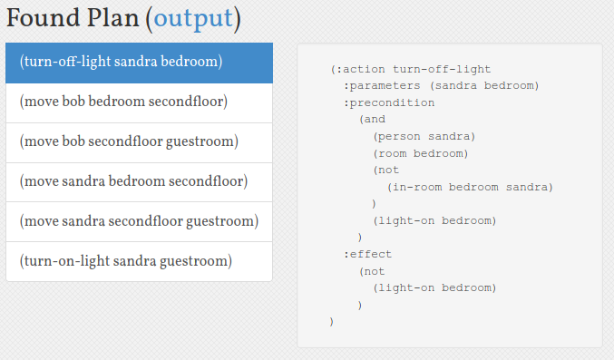

# Planning - Problems

At the beginning of the day, Sandra and Bob are
in the Bedroom, where light is turned on.
Both residents want to go to the Guestroom.
To save energy, ther light of a room has to
be turned off, when no resident is in a room.
Otherwise, if a resident enters a room, the 
light has to be turned on.

<table>
    <tr>
        <th>Objects</th>
        <td>
            Persons: Sandra, Bob;
            Rooms: Bedroom, Second Floor, Guestroom
        </td>
    </tr>
    <tr>
        <th>Predicates</th>
        <td>
            Is x a person?;
            Is x a room?;
            Is light on in x?;
            Can move between x and y?
        </td>
    </tr>
    <tr>
        <th>Initial State</th>
        <td>
            Sandra and Bob are in Bedroom;
            Bedroom light is on, all other lights
            are off;
            From Bedroom movement is allowed only to 
            Second-Floor;
            From Second-Floor movement is allowed to
            Bedroom and Guestroom;
            From Guestroom mevement is allowed only to
            Second-Floor
        </td>
    </tr>
    <tr>
        <th>Goal</th>
        <td>
            Sandra and Bob are in Guestroom;
            Light is on in Guestroom, off in
            Bedroom and Second-Floor
        </td>
    </tr>
    <tr>
        <th>Actions</th>
        <td>
            Sandra and Bob can move between rooms;
            The light in a room can be turned on
            or off
        </td>
    </tr>
</table>

# Output

